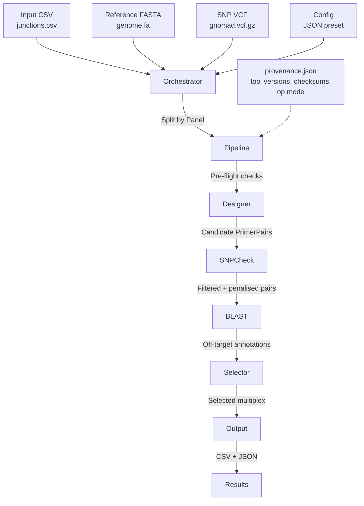

# Plexus Implementation

Plexus is a Python bioinformatics tool that automates multiplex PCR primer panel design for
personalized ctDNA analysis. It takes a list of genomic target junctions and designs optimal
primers, checking for SNP overlap, specificity (BLAST), and optimizing for minimal cross-dimers.
Typical panels are fewer than 50 primer pairs; this scale keeps thermodynamic calculations fast
while BLAST specificity checks and multiplex optimization dominate runtime.

## Architecture

The system is designed as a modular pipeline orchestrated by a high-level controller.

### Core Modules

1. **Orchestrator (`orchestrator.py`)**:
    * Entry point for all `plexus run` invocations.
    * Reads the input CSV and checks for a `Panel` column.
    * Without a `Panel` column: runs a single `run_pipeline()` call.
    * With a `Panel` column: splits junctions by panel ID and runs `run_pipeline()` for each
      panel, either sequentially or via `ProcessPoolExecutor` (`--parallel`).
    * Aggregates results into a `MultiPanelResult`.

2. **Pipeline (`pipeline.py`)**:
    * The central workflow engine. Returns a `PipelineResult` dataclass.
    * Steps:
        1. **Pre-flight**: Tool availability check (`get_missing_tools()`), disk space check
           (`check_disk_space()`), compliance environment validation (`validate_environment()`
           in compliance mode).
        2. **Provenance**: Writes `provenance.json` to the output directory before any
           pipeline work (see Provenance section below).
        3. **Load Config & Panel**: Reads junction CSV and extracts design regions from FASTA.
        4. **Design Primers**: Enumerates k-mer candidates using the `simsen` algorithm
           (`designer` module); `primer3-py` is used for thermodynamic filtering only
           (hairpin and self-dimer ΔG).
        5. **SNP Check (Optional)**: Filters and penalizes primers overlapping common SNPs
           using `snpcheck` against a tabix-indexed VCF.
        6. **Specificity Check (Optional)**: Runs BLAST against the reference genome to find
           off-target binding sites and amplicons.
        7. **Multiplex Optimization**: Selects the best combination of primer pairs using a
           configurable `selector` algorithm.
        8. **Save Results**: Outputs CSV files and JSON summaries to the output directory.

3. **Designer (`designer/`)**:
    * Implements the `simsen` k-mer enumeration algorithm: exhaustively generates candidate
      primers of varying lengths from the sequence flanking each junction.
    * Thermodynamic filtering uses `primer3-py` (`ThermoAnalysis`) for hairpin and self-binding
      ΔG. `primer3-py` does **not** perform primer design — Plexus does that itself.
    * Manages `Junction`, `Primer`, and `PrimerPair` dataclasses.
    * **Tail sequences** (`forward_tail` / `reverse_tail` in config): adapter sequences
      prepended to the forward and reverse primers respectively (at the 5′ end of each).
      `Primer.seq` always holds the bare genomic binding sequence and is never mutated. Tails
      are applied in exactly two places:
        * *Dimer scoring*: tailed sequences (`tail + primer.seq`) are passed to
          `PrimerDimerPredictor` so that cross-dimer scores reflect the real oligonucleotide
          that will be ordered. Any `N` bases in tails are replaced with `A` before scoring to
          avoid `KeyError`s in the nearest-neighbour thermodynamic tables.
        * *CSV output*: `Forward_Full_Seq` / `Reverse_Full_Seq` columns in
          `candidate_pairs.csv` and `selected_multiplex.csv` contain the original tail
          (Ns preserved) concatenated with the binding sequence, providing ready-to-order
          sequences. BLAST, Tm, GC%, and hairpin calculations all use the bare binding sequence.

4. **SNP Check (`snpcheck/`)**:
    * `get_snp_vcf()` resolves the VCF in priority order: (1) `--snp-vcf` flag,
      (2) `$PLEXUS_SNP_VCF` env var, (3) registered VCF from the genome registry
      (`get_registered_snp_vcf(genome)`), (4) error.
    * Queries a tabix-indexed VCF for variants overlapping each primer.
    * Variants above the configured allele frequency threshold (`snp_af_threshold`, default
      0.01) are flagged. The current penalty calculation is position-weighted (proximity to the
      3′ end increases penalty) but treats all SNPs above the threshold equally regardless of
      allele frequency — AF weighting is a planned improvement (see ROADMAP SCI-01).
    * `--snp-strict` mode discards any pair that overlaps a SNP above the AF threshold.
    * `detect_chrom_naming_mismatch()` warns (research mode) or errors (compliance mode) when
      the FASTA and VCF use different chromosome naming conventions (`chr1` vs `1`).

5. **Selector (`selector/`)**:
    * **Cost Function** (`cost.py`): `MultiplexCostFunction.calc_cost()` returns a scalar
      combining:
        * `pair_penalty`: per-pair design quality score (Tm deviation, GC%, end stability)
        * `snp_penalty`: weighted sum of SNP scores for the set
        * `off_target_count × wt_off_target`: BLAST off-target binding sites
        * cross-dimer scores: 3′-end-biased dimer ΔG between all pairs of primers in the set,
          using a cached pairwise scoring approach
    * **Algorithms** (choose with `--selector`):
        * `Greedy` (default): Iteratively adds the primer pair that minimises overall cost.
          Uses `random.shuffle()` on candidate order — non-deterministic without a seed (see
          ROADMAP REPR-02).
        * `Random`: Randomly shuffles junction order on each iteration.
        * `BruteForce`: Exhaustive enumeration of all combinations (suitable for small panels).
        * `SimulatedAnnealing`: Stochastic optimisation with a configurable cooling schedule.
        * `DFS`: Depth-first search over the candidate space.

6. **BLAST (`blast/`)**:
    * Wraps local BLAST+ execution using `blastn-short` task (optimized for primer-length
      queries, word size 7).
    * `makeblastdb` is called once at initialization; the database is reused on subsequent runs.
    * BLAST+ v5 database format (`.njs`) is detected alongside the legacy v4 format (`.nhr`).
    * `AmpliconFinder` pairs forward/reverse hits to identify predicted amplicons.
    * `build_annotation_dict()` annotates each hit with `predicted_bound` and `from_3prime`
      (correctly uses `qlen`, not alignment length).

### Data Flow



## Operational Modes

Plexus supports two operational modes, stored in `~/.plexus/config.json` and overridable via
`PLEXUS_MODE` environment variable or `plexus init --mode`.

| Feature | `research` (default) | `compliance` |
| --- | --- | --- |
| Registry fallback (omit `--fasta`) | ✓ | ✗ — `--fasta` required |
| Checksum verification | Optional (`--strict`) | Always on |
| Tool version enforcement | No | Yes — `validate_environment()` |
| Chromosome naming mismatch | Warning | Fatal error |
| Intended use | Exploratory design, development | Clinical/diagnostic production |

**Priority stack** (highest wins): `PLEXUS_MODE` env var → `~/.plexus/config.json` → `"research"`.

The Docker image sets `ENV PLEXUS_MODE=compliance` so all container runs are automatically
compliance mode without manual configuration.

## Resource Management (`resources.py`)

`resources.py` is the single source of truth for genome registry, SHA-256 checksums, cache
directory, and operational mode.

* **Registry**: `~/.plexus/data/registry.json` maps genome names to registered FASTA and VCF
  paths along with their SHA-256 checksums. Populated by `plexus init`.
* **`init_genome()` orchestration** (6 steps): validate preset → set operational mode →
  parse checksums file → register SNP VCF → register FASTA → build `.fai` index →
  build BLAST database → validate chromosome naming → store registry entry with SHA-256s.
  Both `--fasta` and `--snp-vcf` are required (or `--skip-snp`). There is no download path.
* **`GENOME_PRESETS`**: named registry of supported genomes. Contains only `description` —
  URL keys were removed in v0.5.1 (ARCH-04). The dict serves as a validation registry: only
  genomes listed here are accepted by `plexus init`.
* **Checksum verification**: two independent paths:
    * *Registry-based*: stored SHA-256 is re-verified at `plexus run` time with `--strict` or
      in compliance mode.
    * *Stateless*: `--checksums` accepts a `sha256sum`-format file; verification occurs on the
      fly without touching the registry. This is the recommended pattern for container use.
* **`get_cache_dir()`**: returns `~/.plexus/` (or `PLEXUS_CACHE_DIR` env var).

## Compliance and Provenance

### Compliance Manifest (`data/compliance_manifest.json`)

Bundled read-only JSON that pins the exact versions of system tools required for compliant
operation. Currently covers:

| Tool | Pinned version |
| --- | --- |
| `blastn` | 2.17.0 |
| `makeblastdb` | 2.17.0 |
| `blast_formatter` | 2.17.0 |
| `bcftools` | 1.23 |

`validate_environment()` in `utils/env.py` checks installed tool versions against the manifest
using regex extraction and raises `ComplianceError` on any mismatch or missing tool. The manifest
also includes a `python_packages` section (AUDT-02) that pins `primer3-py` and `pysam` versions,
which are verified via `importlib.metadata` at runtime.

### Provenance (`provenance.json`)

Written to the output directory before the pipeline starts. Contains:

```json
{
  "plexus_version": "0.5.1",
  "primer3_version": "2.x.x",
  "tool_versions": {"blastn": "...", "bcftools": "..."},
  "run_timestamp": "2026-01-20T10:00:00+00:00",
  "operational_mode": "compliance",
  "genome": "hg38",
  "fasta_path": "/data/hg38.fa",
  "fasta_sha256": "abc123...",
  "snp_vcf_path": "/data/gnomad.vcf.gz",
  "snp_vcf_sha256": "def456...",
  "run_blast": true,
  "skip_snpcheck": false,
  "compliance_environment": { ... }
}
```

The `compliance_environment` block is present only in compliance mode and contains the full
`validate_environment()` verdict per tool. `panel_summary.json` (written at run end) embeds
the same provenance plus `steps_completed` and any `errors`.

**Known limitation**: `provenance.json` is written at startup; if the pipeline fails midway
it does not reflect the failure. See ROADMAP AUDT-03 for the planned fix (write `"status":
"started"` at startup, re-write with `"status": "completed"` / `"failed"` on exit).

## Tech Stack

* **Language**: Python 3.10–3.13
* **Package Management**: `uv`
* **Containerization**: Docker (multi-stage build)
* **Key Libraries**:
    * `primer3-py`: Thermodynamic calculations (Tm, hairpin, self-dimer ΔG) — not primer design
    * `pydantic`: Config validation and settings management
    * `pandas`: Data manipulation and CSV I/O
    * `typer` + `rich`: CLI framework and terminal output
    * `loguru`: Structured logging (file + stderr)
    * `biopython`: Sequence handling
    * `pysam`: VCF/BAM/FASTA index handling (tabix queries, `.fai` reads)

## Configuration

Configuration is managed via Pydantic models in `src/plexus/config.py`. The top-level
`DesignerConfig` composes:

* `SingleplexDesignParameters` — primer length range, Tm range, GC% range, hairpin/dimer ΔG
  thresholds, junction padding
* `PrimerPairParameters` — product size range, Tm difference max, pair penalty weights
* `PCRConditions` — salt concentration, annealing temperature (used for Tm calculations)
* `MultiplexPickerParameters` — selector algorithm, iteration counts, cost function weights
  (`wt_off_target`, `wt_lt`, `wt_gt`), plexity targets
* `SnpCheckParameters` — AF threshold, strict mode, position weight curve

Two built-in presets are bundled as JSON:

* `default` (`config/designer_default_config.json`) — conservative thermodynamic thresholds
* `lenient` (`config/designer_lenient_config.json`) — relaxed thresholds for difficult junctions

Users can supply a custom JSON with `--config` / `-c`. Generate a template with
`plexus template`.

## Installation & Setup

### Prerequisites

* Python 3.10–3.13
* `uv` (`curl -LsSf https://astral.sh/uv/install.sh | sh`)
* NCBI BLAST+ 2.17.0 — `blastn`, `makeblastdb`, `blast_formatter` (for specificity checks)
* `bcftools` 1.23 (for SNP checking)
* Reference genome FASTA (hg38 recommended; obtain from UCSC, Ensembl, or GATK bundle)
* gnomAD AF-only tabix-indexed VCF (optional; required for SNP checking)

### Development Setup

```bash
git clone https://github.com/sfilges/plexus.git
cd plexus
uv pip install -e ".[dev]"
```

### Register Resources

Before first use, register your reference FASTA and SNP VCF:

```bash
# Register local files (recommended)
plexus init --fasta /path/to/hg38.fa --snp-vcf /path/to/gnomad_af_only.vcf.gz

# Register with checksum verification
plexus init --fasta /path/to/hg38.fa --snp-vcf /path/to/gnomad.vcf.gz \
    --checksums /path/to/checksums.sha256

# Set compliance mode during init
plexus init --fasta /path/to/hg38.fa --snp-vcf /path/to/gnomad.vcf.gz \
    --mode compliance

# Skip BLAST index (faster init, but --skip-blast required at run time)
plexus init --fasta /path/to/hg38.fa --skip-snp
```

### Run Tests

```bash
uv run python -m pytest tests/ -v --tb=short
uv run python -m pytest -m integration  # integration tests (require BLAST+)
```

## CLI Reference

```
plexus [--version]

Commands:
  run        Run the complete primer design pipeline
  init       Register and index reference resources
  status     Show Plexus version, operational mode, and resource status
  template   Generate starter files for a new design workspace
  docker     Run the Plexus compliance container (auto volume mounting)
```

### `plexus run`

```bash
plexus run \
    --input junctions.csv \          # required
    --fasta hg38.fa \                # required (or use registry in research mode)
    --output output_dir/ \           # default: ./output
    --name my_panel \
    --genome hg38 \
    --preset default \               # or: lenient
    --config custom.json \
    --selector Greedy \              # Greedy | Random | BruteForce | SimulatedAnnealing | DFS
    --snp-vcf gnomad.vcf.gz \
    --snp-af-threshold 0.01 \
    --snp-strict \
    --skip-snpcheck \
    --skip-blast \
    --padding 200 \
    --parallel \                     # multi-panel only
    --max-workers 4 \
    --strict \                       # verify registry checksums
    --checksums checksums.sha256 \   # stateless checksum verification
    --debug
```

### `plexus init`

```bash
plexus init \
    --genome hg38 \
    --fasta /path/to/hg38.fa \
    --snp-vcf /path/to/gnomad.vcf.gz \
    --checksums checksums.sha256 \
    --mode compliance \              # or: research
    --skip-blast \
    --skip-snp \
    --force
```

### `plexus template`

```bash
plexus template --output ./my_design/
# Creates: junctions.csv (example rows) and designer_config.json (default preset values)
```

### `plexus status`

Shows Plexus version, operational mode, system dependency availability, and registered genome
resources with their checksum fingerprints.

### `plexus docker`

Wrapper around `docker run` that automatically mounts parent directories of all file arguments
and translates host paths to container paths. Pulls the image from
`ghcr.io/sfilges/plexus:<tag>` (local-first lookup) if not present.

```bash
plexus docker \
    --tag 1.0.0 \
    --fasta /data/hg38.fa \
    --snp-vcf /data/gnomad.vcf.gz \
    --checksums /data/checksums.sha256 \
    --input /data/junctions.csv \
    --output /data/results/ \
    --skip-blast
    # Additional plexus run flags (--selector, --preset, etc.) are passed through
```

## Docker

The project ships a multi-stage Dockerfile:

1. **Python builder stage**: installs Python dependencies with `uv` into a virtual environment
2. **Tools stage**: installs exact-version system tools (BLAST+ 2.17.0, bcftools 1.23) from
   Bioconda using conda, ensuring the compliance manifest is satisfied
3. **Runtime stage**: copies the venv and tools into a minimal image, creates a non-root user,
   sets `ENV PLEXUS_MODE=compliance`, and sets `ENTRYPOINT ["plexus"]`

```bash
# Build
docker build -t plexus:latest .

# Run directly (manual volume mounting)
docker run \
    -v /data:/mnt/data \
    -e PLEXUS_MODE=compliance \
    plexus:latest \
    plexus run --fasta /mnt/data/hg38.fa --input /mnt/data/junctions.csv \
               --checksums /mnt/data/checksums.sha256 --output /mnt/data/results/

# Run via plexus docker wrapper (auto volume mounting, recommended)
plexus docker --tag 0.5.1 --fasta /data/hg38.fa --input /data/junctions.csv \
              --checksums /data/checksums.sha256 --output /data/results/
```

## Output Files

| File | Description |
| --- | --- |
| `provenance.json` | Tool versions, checksums, operational mode, run timestamp |
| `candidate_pairs.csv` | All primer pairs that passed design filters, one row per pair |
| `selected_multiplex.csv` | Final selected panel — one row per junction with `Forward_Full_Seq` / `Reverse_Full_Seq` (tail + binding sequence) |
| `panel_summary.json` | Panel statistics, steps completed, errors, embedded provenance |
| `off_targets.csv` | BLAST off-target amplicons for the selected pairs |
| `blast_results/` | Raw BLAST output and annotated hit tables |
| `plexus_run.log` | Full pipeline log (INFO by default; DEBUG with `--debug`) |

## Programmatic API

```python
from plexus.pipeline import run_pipeline
from plexus.orchestrator import run_multi_panel

# Single panel
result = run_pipeline(
    input_file="junctions.csv",
    fasta_file="hg38.fa",
    output_dir="output/",
    snp_vcf="gnomad.vcf.gz",
    selector="Greedy",
)

# Multi-panel (reads 'Panel' column from CSV)
result = run_multi_panel(
    input_file="junctions.csv",
    fasta_file="hg38.fa",
    output_dir="output/",
    parallel=True,
    max_workers=4,
)
```
