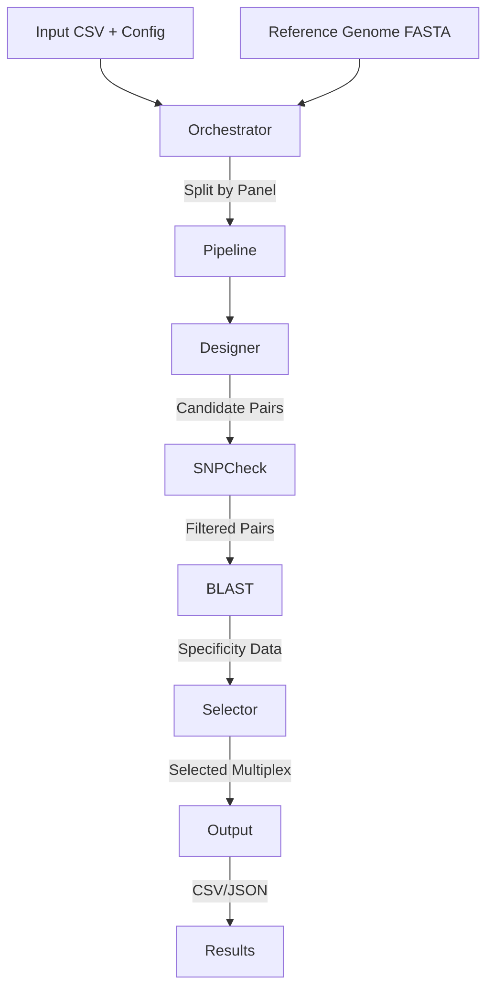

# Plexus Implementation

Plexus is a Python package for designing multiplex PCR primer panels. It takes a list of genomic target junctions and designs optimal primers, checking for SNP overlap, specificity (BLAST), and optimizing for minimal cross-dimers.

## Architecture

The system is designed as a modular pipeline orchestrated by a high-level controller.

### Core Modules

1.  **Orchestrator (`orchestrator.py`)**:
    *   Handles multi-panel logic.
    *   Splits input CSV by "Panel" column (if present).
    *   Runs the pipeline for each panel (sequentially or in parallel).
    *   Aggregates results into a `MultiPanelResult`.

2.  **Pipeline (`pipeline.py`)**:
    *   The central workflow engine.
    *   Steps:
        1.  **Load Config & Panel**: Reads junction CSV and reference genome.
        2.  **Design Primers**: Enumerates k-mer candidates around each junction using the `simsen` algorithm (`designer` module); `primer3-py` is used only for thermodynamic calculations (hairpin, self-dimer ΔG).
        3.  **SNP Check (Optional)**: Filters primers overlapping high-MAF SNPs using `snpcheck` against a tabix-indexed VCF (bundled gnomAD or user-supplied).
        4.  **Specificity Check (Optional)**: Runs BLAST against the reference genome to find off-targets.
        5.  **Multiplex Optimization**: Selects the best combination of primers using a configurable `selector` algorithm.
        6.  **Save Results**: Outputs CSVs and JSON summaries.

3.  **Designer (`designer/`)**:
    *   Implements the `simsen` k-mer enumeration algorithm: exhaustively generates candidate primers of varying lengths from the sequence flanking each junction.
    *   Thermodynamic filtering uses `primer3-py` (`ThermoAnalysis`) for hairpin and self-binding ΔG.
    *   Manages `Junction` and `PrimerPair` objects.

4.  **SNP Check (`snpcheck/`)**:
    *   Checks primers against a VCF file (default: bundled gnomAD AF-only VCF, downloaded via `plexus download-resources`).
    *   Calculates penalties based on allele frequency and position relative to the 3′ end.
    *   `--snp-strict` mode discards any pair that overlaps a SNP above the AF threshold.

5.  **Selector (`selector/`)**:
    *   **Cost Function**: Calculates the "cost" of a primer set based on cross-dimer potential (ΔG).
    *   **Algorithms** (choose with `--selector`):
        *   `Greedy` (default): Iteratively adds the primer pair that minimises overall cost.
        *   `Random`: Randomly shuffles junction order on each iteration.
        *   `BruteForce`: Exhaustive enumeration of all combinations.
        *   `SimulatedAnnealing`: Stochastic optimisation with cooling schedule.
        *   `DFS`: Depth-first search over the candidate space.

6.  **BLAST (`blast/`)**:
    *   Wraps local BLAST+ execution.
    *   Parses output to identify non-specific binding sites.
    *   Checks for required tools at startup and raises a clear error if `blastn` is not found.

### Data Flow



## Tech Stack

*   **Language**: Python 3.10–3.13
*   **Package Management**: `uv` (replaces pip/poetry for speed and reliability).
*   **Containerization**: Docker (Multi-stage build).
*   **Key Libraries**:
    *   `primer3-py`: Thermodynamic calculations (hairpin, self-dimer ΔG) — not primer design.
    *   `pydantic`: Data validation and settings management.
    *   `pandas`: Data manipulation.
    *   `typer`: CLI framework.
    *   `loguru`: Logging.
    *   `biopython`: Sequence handling.
    *   `pysam`: VCF/BAM handling.

## Installation & Development

### Prerequisites

*   Python 3.10–3.13
*   `uv` installed (`curl -LsSf https://astral.sh/uv/install.sh | sh`)
*   NCBI BLAST+ (for specificity checks)
*   `bcftools` (for SNP checking)

### Setup

1.  **Clone the repository**:
    ```bash
    git clone https://github.com/sfilges/plexus.git
    cd plexus
    ```

2.  **Install dependencies**:
    ```bash
    uv sync
    ```

3.  **Download SNP resources** (required before first SNP check):
    ```bash
    plexus download-resources
    ```

4.  **Run tests**:
    ```bash
    uv run pytest
    ```

### Docker

The project uses a multi-stage Dockerfile optimized with `uv`.

**Build:**
```bash
docker build -t plexus .
```

**Run:**
```bash
docker run -v $(pwd)/data:/data plexus plexus --help
```

## Configuration

Configuration is managed via `pydantic` models in `src/plexus/config.py`. Users can provide a JSON configuration file or use built-in presets (`default`, `lenient`).

## CLI Usage

The package exposes a CLI via `plexus`.

```bash
# Design a single panel
plexus run --input targets.csv --fasta hg38.fa --output output_dir

# Check resource status
plexus status

# Download bundled gnomAD VCF for SNP checking
plexus download-resources
```

See `plexus --help` for full command details.
