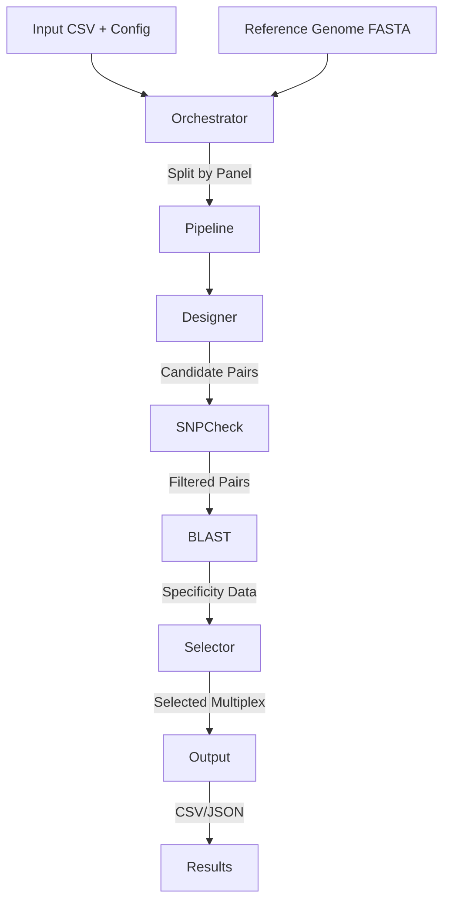

# Plexus Implementation

Plexus is a Python package for designing multiplex PCR primer panels. It takes a list of genomic target junctions and designs optimal primers, checking for specificity (BLAST), avoid SNPs, and optimizing for minimal cross-dimers.

## Architecture

The system is designed as a modular pipeline orchestrated by a high-level controller.

### Core Modules

1.  **Orchestrator (`orchestrator.py`)**:
    *   Handles multi-panel logic.
    *   Splits input CSV by "Panel" column (if present).
    *   Runs the pipeline for each panel (sequentially or in parallel).
    *   Aggregates results into a `MultiPanelResult`.

2.  **Pipeline (`pipeline.py`)**:
    *   The central workflow engine.
    *   Steps:
        1.  **Load Config & Panel**: Reads junction CSV and reference genome.
        2.  **Design Primers**: Uses `primer3-py` via the `designer` module.
        3.  **SNP Check (Optional)**: Filters primers overlapping high-MAF SNPs using `snpcheck`.
        4.  **Specificity Check (Optional)**: Runs BLAST against the reference genome to find off-targets.
        5.  **Multiplex Optimization**: Selects the best combination of primers to minimize cross-interactions using a Greedy algorithm (`selector`).
        6.  **Save Results**: Outputs CSVs and JSON summaries.

3.  **Designer (`designer/`)**:
    *   Encapsulates primer design logic.
    *   Manages `Junction` and `PrimerPair` objects.
    *   Interfaces with `primer3-py`.

4.  **SNP Check (`snpcheck/`)**:
    *   Checks primers against a VCF file (e.g., gnomAD).
    *   Calculates penalties based on allele frequency and position relative to the 3' end.

5.  **Selector (`selector/`)**:
    *   **Cost Function**: Calculates the "cost" of a primer set based on dimer potential (ΔG).
    *   **Greedy Selector**: Iteratively builds the multiplex panel by adding the best-performing primer pair that minimizes the overall cost.

6.  **BLAST (`blast/`)**:
    *   Wraps local BLAST+ execution.
    *   Parses output to identify non-specific binding.

### Data Flow



## Tech Stack

*   **Language**: Python 3.13+
*   **Package Management**: `uv` (replaces pip/poetry for speed and reliability).
*   **Containerization**: Docker (Multi-stage build).
*   **Key Libraries**:
    *   `primer3-py`: Primer design engine.
    *   `pydantic`: Data validation and settings management.
    *   `pandas`: Data manipulation.
    *   `typer`: CLI framework.
    *   `loguru`: Logging.
    *   `biopython`: Sequence handling.
    *   `pysam`: VCF/BAM handling.

## Installation & Development

### Prerequisites

*   Python 3.13+
*   `uv` installed (`curl -LsSf https://astral.sh/uv/install.sh | sh`)
*   NCBI BLAST+ (for specificity checks)

### Setup

1.  **Clone the repository**:
    ```bash
    git clone https://github.com/sfilges/plexus.git
    cd plexus
    ```

2.  **Install dependencies**:
    ```bash
    uv sync
    ```

3.  **Run tests**:
    ```bash
    uv run pytest
    ```

### Docker

The project uses a multi-stage Dockerfile optimized with `uv`.

**Build:**
```bash
docker build -t plexus .
```

**Run:**
```bash
docker run -v $(pwd)/data:/data plexus plexus --help
```

## Configuration

Configuration is managed via `pydantic` models in `src/plexus/config.py`. Users can provide a JSON configuration file or use built-in presets ("default", "lenient").

## CLI Usage

The package exposes a CLI via `plexus`.

```bash
plexus define-panel --input targets.csv --fasta hg38.fa --output output_dir
```

See `plexus --help` for full command details.
